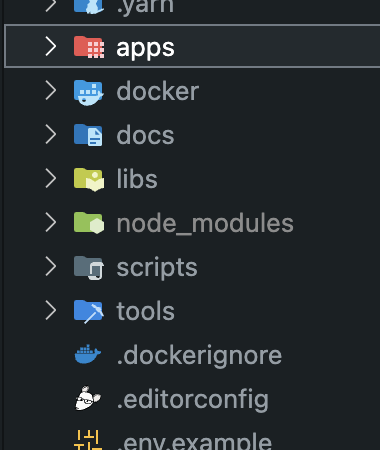
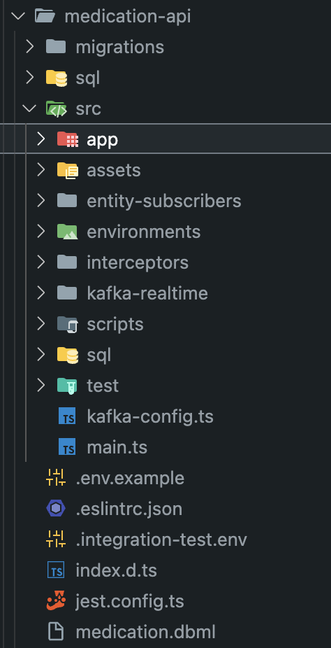
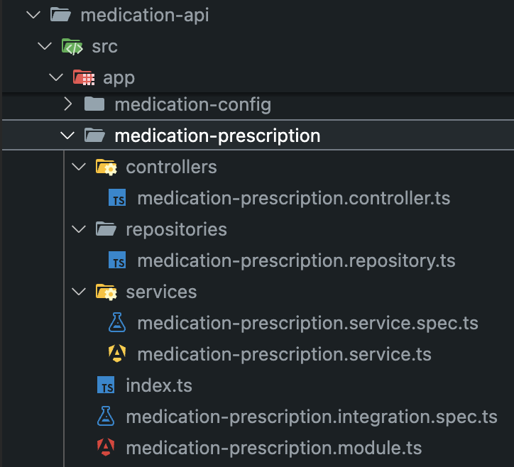
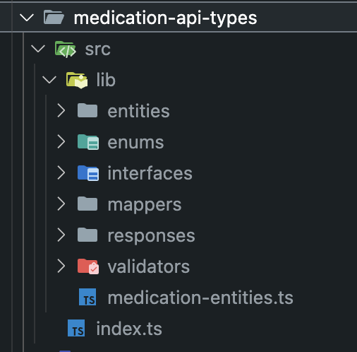

# Latest project structure

เป็น monorepo (using [Nx](https://nx.dev/))  
- **apps** - app, service ทั้ง backend และ frontend หรือ worker, utility app ต่างๆ
- **libs** - shared lib ที่ใช้ร่วมกันระหว่าง app และ type ต่างๆ
- **docker** - docker file ของแต่ละ app
- **docs** - รวม document และ code convention
- **scripts** - manual script
___
**apps/[service-name]**  

  

- **migrations** - db schema migration file
- **sql** - sql script กรณที่จำเป็นต้องใช้
- **entity-subscriber** - subscriber ของ typeorm เมื่อเกิด event ขึ้นกับ db entity
- **environments** - parse ข้อมูลจาก process.env ใส่ใน ts file และ format ค่าให้ง่ายต่อการเอาไปใช้
- **interceptors** - nestjs interceptor
- **kafka-realtime** - kafka controller (consumer) และ kafka service (publisher)
- **test** - mock data และ factory สำหรับ test
- **.dbml** - er diagram
___
**apps/[service-name]/src/app/[application usecase]**  

- **controller** - manage routing, http request ต่างๆ, response data, response status
- **integration spec** - integration test
- **module** - nestjs module (di container)
- **repository** - จัดการส่วนที่ติดต่อกับ database
- **service** - handle เรื่อง business logic
- **service spec** - unit test จะ test ที่ระดับ service
___
**libs/[service types]**  

- **entities** - db entity
- **enums** - enum
- **interfaces** - shared interface ทั่วๆไป และ DTO
- **mappers** - data mapper ต่างๆ เช่นใช้ map จาก entity เป็น api response
- **responses** - api response
- **validator** - validator สำหรับ api query/params/body
